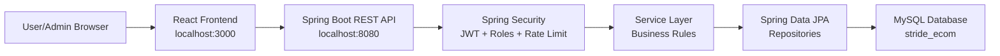
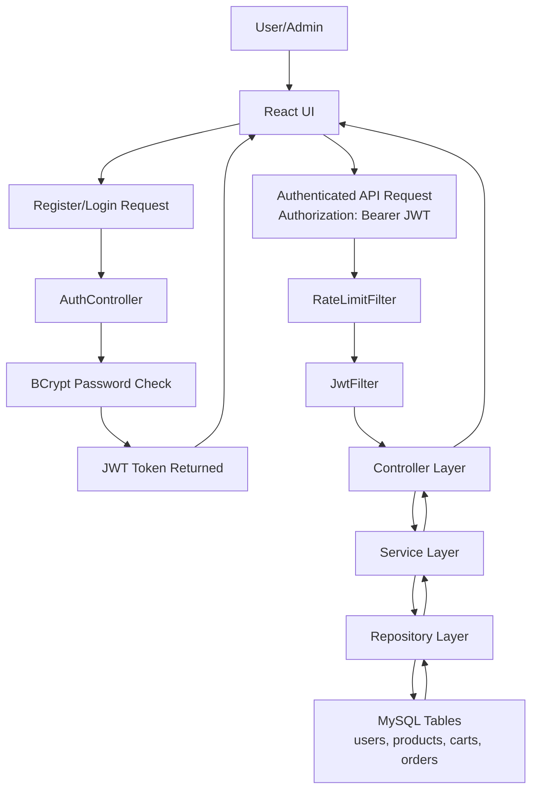

# STRIDE E-Commerce Architecture and DFD

This document gives a simple view of the project for college mini-project
presentation and STRIDE threat modeling.

## 1. Project Structure

```text
ecom/
  frontend/        React.js user interface
  backend/         Spring Boot REST API
    controller/    API endpoints
    service/       Business logic
    repository/    Spring Data JPA repositories
    entity/        Database entities
    dto/           Request/response models
    security/      JWT filter, JWT utility, rate limiting
    config/        Spring Security, CORS, sample data
  docs/            Schema, STRIDE report, diagrams
```

## 2. Simple Architecture Diagram



## 3. Data Flow Diagram



## 4. Security Mapping

| Requirement | Implementation |
|---|---|
| JWT Authentication | `security/JwtUtil.java`, `security/JwtFilter.java` |
| Password hashing | `BCryptPasswordEncoder` in `config/SecurityConfig.java` |
| USER/ADMIN authorization | `SecurityConfig.java` and `@PreAuthorize` on admin APIs |
| Input validation | DTO classes with `@NotBlank`, `@Email`, `@Min`, `@DecimalMin` |
| Rate limiting | `security/RateLimitFilter.java` limits auth requests by IP |
| Secure endpoints | Public product/auth APIs, protected cart/order/admin APIs |
| Server-side price calculation | `OrderService.java` calculates totals from DB prices |
| Sample data | `config/DataInitializer.java` |

## 5. Main REST APIs

| Area | Endpoint | Access |
|---|---|---|
| Auth | `POST /api/auth/register` | Public |
| Auth | `POST /api/auth/login` | Public |
| Products | `GET /api/products` | Public |
| Cart | `GET /api/cart` | USER/ADMIN |
| Cart | `POST /api/cart/add` | USER/ADMIN |
| Orders | `POST /api/orders` | USER/ADMIN |
| Orders | `GET /api/orders` | USER/ADMIN |
| Admin Products | `POST /api/admin/products` | ADMIN |
| Admin Products | `PUT /api/admin/products/{id}` | ADMIN |
| Admin Products | `DELETE /api/admin/products/{id}` | ADMIN |
| Admin Orders | `GET /api/admin/orders` | ADMIN |
| Admin Orders | `PUT /api/admin/orders/{id}/status` | ADMIN |
